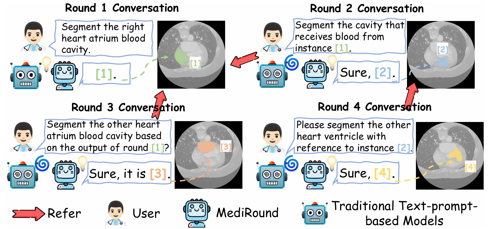
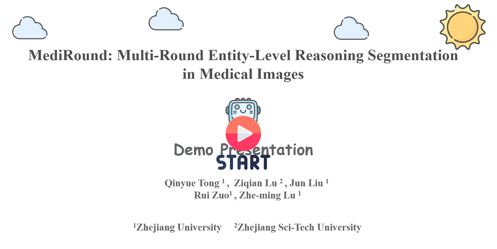

<p align="center">

  <h2 align="center">
  MediRound: Multi-Round Entity-Level Reasoning Segmentation in Medical Images


  </h2>
  <p align="center">
    <a><strong>Qinyue Tong</strong></a><sup>1</sup>
    ·
    <a href="https://scholar.google.com/citations?user=qx1yRVEAAAAJ&hl=zh-CN"><strong>Ziqian Lu</strong></a><sup>2</sup>
    ·
    <a><strong>Jun Liu</strong></a><sup>1</sup>
    <br>
    <a><strong>Rui Zuo</strong></a><sup>1</sup>
    ·
    <a href="https://person.zju.edu.cn/lzmhome"><strong>Zhe-ming Lu</strong></a><sup>1</sup>
    <!-- <br> -->
    <br>
    <sup>1</sup>Zhejiang University, <sup>2</sup>Zhejiang Sci-Tech University
    <br>
    🧑‍💼 <b><i>Project Leader: Prof. Zhe-ming Lu</i></b>
    <br>
    <div align="center">
    <a href="https://arxiv.org/abs/2511.12110"></a>
    </div>
  </p>
</p>
  


## :mega: News
- **2025.11.20**: We’ve uploaded our paper *MediRound: Multi-Round Entity-Level Reasoning Segmentation in Medical Images* to arXiv and set up this repository! Welcome to **watch** 👀 this repository for the latest updates.

## :memo: ToDo List
- [ ] Release ***training codes***.
- [ ] Release ***MR-MedSeg*** benchmark.
- [ ] Release ***evaluating codes***.
- [ ] Release ***demo codes*** and MediRound ***pre-trained weights***. 


## :camera: Video Demo Presentation

You can watch the MediRound demo video to better understand its mechanism and workflow. You can either click the play button below or use the link [MediRound Demo Presentation](https://youtu.be/iRD_cvi-I88).

[](https://youtu.be/iRD_cvi-I88)


## :clap: Acknowledgements
This project is developed on the codebase of [SegLLM](https://github.com/berkeley-hipie/segllm) and data from [SA-Med2D-20M Dataset](https://github.com/OpenGVLab/SAM-Med2D). We appreciate their valuable contributions! 

## :love_you_gesture: Citation
If you find our paper is helpful for your research, please consider citing:
```BibTeX
@article{tong2025mediround,
  title={MediRound: Multi-Round Entity-Level Reasoning Segmentation in Medical Images},
  author={Tong, Qinyue and Lu, Ziqian and Liu, Jun and Zuo, Rui and Lu, Zheming},
  journal={arXiv preprint arXiv:2511.12110},
  year={2025}
}
```
