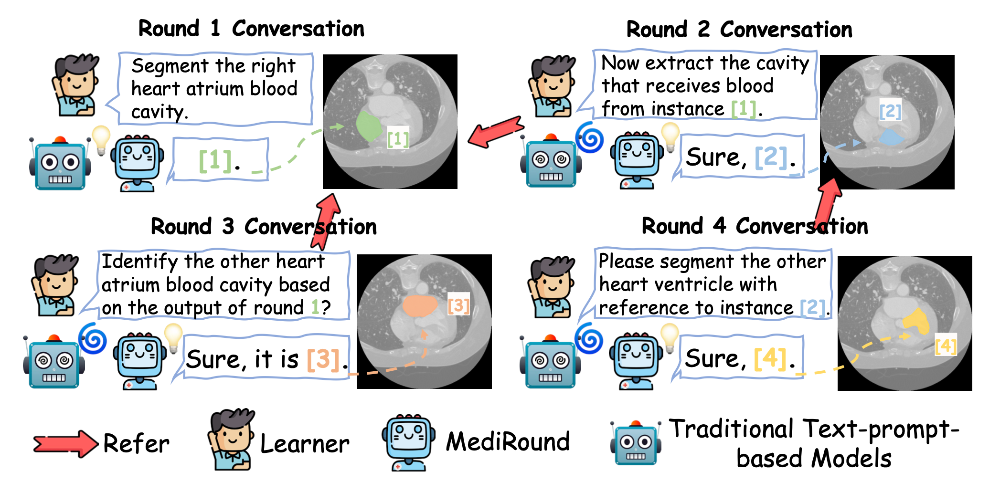

<p align="center">

  <h2 align="center">
  MediRound: Multi-Round Entity-Level Reasoning Segmentation in Medical Images


</h2>
  <p align="center">
    <a><strong>Qinyue Tong</strong></a><sup>1</sup>
    ·
    <a href="https://scholar.google.com/citations?user=qx1yRVEAAAAJ&hl=zh-CN"><strong>Ziqian Lu</strong></a><sup>2</sup>
    ·
    <a><strong>Jun Liu</strong></a><sup>1</sup>
    ·
    <a><strong>Rui Zuo</strong></a><sup>1</sup>
    ·
    <a href="https://person.zju.edu.cn/lzmhome"><strong>Zheming Lu</strong></a><sup>1</sup>
    ·
    <a href="https://yuemingjin.github.io"><strong>Yueming Jin</strong></a><sup>3</sup>
    <br>
    <sup>1</sup>Zhejiang University, 
    <sup>2</sup>Zhejiang Sci-Tech University, 
    <sup>3</sup>National University of Singapore
    <br>
    🧑‍💼 <b><i>Project Leader: Prof. Zheming Lu</i></b>
    <br>
    <div align="center">
      <a href="https://arxiv.org/abs/2511.12110"></a>
      <a href="https://www.youtube.com/watch?v=JPb2UwbDOwg"></a>
      <a href='https://huggingface.co/Carryyy/MR-MedSeg/tree/main'></a>
    </div>
  </p>
</p>


  


## :mega: News

- **2026.06.24**: :rocket: We have officially released the ***training codes*** and ***evaluating codes***! Researchers and developers can now reproduce, evaluate, and further explore MediRound with a more complete open-source pipeline. :sparkles:
- **2026.06.23**: :fire: We have open-sourced the ***MR-MedSeg*** Feel free to download it and build upon our work for multi-round medical image segmentation. :brain: :star2:
- **2025.11.20**: We’ve uploaded our paper *MediRound: Multi-Round Entity-Level Reasoning Segmentation in Medical Images* to arXiv and set up this repository! Welcome to **watch** :eyes: this repository for the latest updates.


## :camera: Video Demo Presentation

You can watch the MediRound demo video to better understand its mechanism and workflow. You can either click the play button below or use the link [MediRound Demo Presentation](https://www.youtube.com/watch?v=JPb2UwbDOwg).

[](https://www.youtube.com/watch?v=JPb2UwbDOwg)


## Installation

Clone the repository:

```bash
git clone <REPOSITORY_URL>
cd MediRound
```

Create and activate the conda environment:

```bash
conda env create -f environment.yml
conda activate mediround
```

Install dependencies:

```bash
pip install -r requirements.txt
```


## Download the Dataset

The MR-MedSeg dataset is available on HuggingFace: [Carryyy/MR-MedSeg](https://huggingface.co/Carryyy/MR-MedSeg/tree/main). Download the dataset and extract it to a local directory before running training or evaluation. All image and mask paths inside the JSON files are resolved relative to `DATASET_DIR`, so `DATASET_DIR` should point to the dataset root.

You also need to prepare the following model paths:

- `MODEL_NAME_OR_PATH`: local path or HuggingFace identifier for the LLaVA-Med / Mistral backbone.
- `VISION_TOWER`: local path or HuggingFace identifier for the CLIP vision tower.
- `VISION_PRETRAINED`: path to the MedSAM `vit_b` checkpoint.

The training and evaluation JSON format follows `data_sample.json`. The bracket tokens `[IMAGE256:path]`, `[MASK-ENCODE:path]`, `[BOX-ENCODE:path]`, `[MASK-DECODE:path]`, and `[REF-DECODE:path]` should all point to files reachable under `DATASET_DIR`.

## Pre-Checklist

Before running any script, make sure these paths are ready:

```bash
MODEL_NAME_OR_PATH=/path/to/llava-med
VISION_TOWER=/path/to/clip-vit-large-patch14-336
VISION_PRETRAINED=/path/to/medsam_vit_b.pth
DATASET_DIR=/path/to/MR-MedSeg
TRAIN_JSON=/path/to/train.json
EVAL_JSON=/path/to/val_or_test.json
```

`TRAIN_JSON` is required only for training scripts. `EVAL_JSON` is used for validation during training and for standalone evaluation.

## Train MediRound

MediRound training is the first stage of the pipeline and corresponds to end-to-end MediRound training in the paper. Use `scripts/train_stage1.sh`; it passes `--stage 1` to `train_ds.py`, trains the MediRound backbone, and does not enable the two JCM MLPs.

Because compute environments vary, the runtime scale parameters below have no defaults and must be set explicitly:

- `GPU_IDS`: GPU ids to use, written as a comma-separated list.
- `EPOCHS`: number of training epochs.
- `STEPS_PER_EPOCH`: optimization steps per epoch.
- `GRAD_ACCUMULATION_STEPS`: gradient accumulation steps.
- `BATCH_SIZE`: per-device batch size per step.

The number of sampled training examples per epoch is:

```text
num_gpus * STEPS_PER_EPOCH * GRAD_ACCUMULATION_STEPS * BATCH_SIZE
```

The total sampled training examples are:

```text
EPOCHS * num_gpus * STEPS_PER_EPOCH * GRAD_ACCUMULATION_STEPS * BATCH_SIZE
```
For Stage 1 MediRound training, the released training setting iterates over `450000` sampled examples in total. Please choose `EPOCHS`, `GPU_IDS`, `STEPS_PER_EPOCH`, `GRAD_ACCUMULATION_STEPS`, and `BATCH_SIZE` so that:

```text
EPOCHS * num_gpus * STEPS_PER_EPOCH * GRAD_ACCUMULATION_STEPS * BATCH_SIZE = 450000
```

We intentionally leave the concrete hardware-dependent values to the user instead of hard-coding a particular GPU or batch-size setup.

Run training:

```bash
MODEL_NAME_OR_PATH=/path/to/llava-med \
VISION_TOWER=/path/to/clip-vit-large-patch14-336 \
VISION_PRETRAINED=/path/to/medsam_vit_b.pth \
DATASET_DIR=/path/to/MR-MedSeg \
TRAIN_JSON=/path/to/train.json \
EVAL_JSON=/path/to/val.json \
GPU_IDS=your_gpu_ids \
EPOCHS=your_num_epochs \
STEPS_PER_EPOCH=your_steps_per_epoch \
GRAD_ACCUMULATION_STEPS=your_grad_accumulation_steps \
BATCH_SIZE=your_batch_size \
OUTPUT_DIR=./outputs \
EXP_NAME=mediround_stage1 \
bash scripts/train_stage1.sh
```


## Evaluate MediRound

MediRound evaluation tests the first-stage model and corresponds to MediRound without JCM in the paper. Use `scripts/val_stage1.sh`; it passes `--stage 1 --eval_only`, so the JCM MLPs are not called during evaluation.

`WEIGHT` should point to a first-stage MediRound checkpoint directory, for example `./outputs/mediround_stage1/ckpt_model`.

Run evaluation:

```bash
MODEL_NAME_OR_PATH=/path/to/llava-med \
VISION_TOWER=/path/to/clip-vit-large-patch14-336 \
VISION_PRETRAINED=/path/to/medsam_vit_b.pth \
DATASET_DIR=/path/to/MR-MedSeg \
EVAL_JSON=/path/to/val_or_test.json \
WEIGHT=./outputs/mediround_stage1/ckpt_model \
GPU_IDS=your_gpu_ids \
EPOCHS=your_num_epochs \
STEPS_PER_EPOCH=your_steps_per_epoch \
GRAD_ACCUMULATION_STEPS=your_grad_accumulation_steps \
BATCH_SIZE=your_batch_size \
OUTPUT_DIR=./outputs \
EXP_NAME=mediround_stage1_val \
bash scripts/val_stage1.sh
```

The evaluation scripts also require `EPOCHS`, `STEPS_PER_EPOCH`, `GRAD_ACCUMULATION_STEPS`, and `BATCH_SIZE`. In `--eval_only` mode, these values are used to initialize the DeepSpeed configuration and do not trigger training.


## Train JCM

JCM training is the second stage of the pipeline and corresponds to Judgment & Correction Mechanism training in the paper. Use `scripts/train_stage2.sh`; it passes `--stage 2` and requires `WEIGHT` to point to the first-stage MediRound checkpoint.

The number of sampled training examples per epoch is:

```text
num_gpus * STEPS_PER_EPOCH * GRAD_ACCUMULATION_STEPS * BATCH_SIZE
```

The total sampled training examples are:

```text
EPOCHS * num_gpus * STEPS_PER_EPOCH * GRAD_ACCUMULATION_STEPS * BATCH_SIZE
```
For Stage 2 JCM training, the released training setting iterates over `540000` sampled examples in total. Please choose `EPOCHS`, `GPU_IDS`, `STEPS_PER_EPOCH`, `GRAD_ACCUMULATION_STEPS`, and `BATCH_SIZE` so that:

```text
EPOCHS * num_gpus * STEPS_PER_EPOCH * GRAD_ACCUMULATION_STEPS * BATCH_SIZE = 540000
```

As above, no specific hardware configuration is assumed in this README.


In this stage, the MediRound backbone is frozen and only two lightweight MLPs are trained:

- `mask_quality_MLP`: predicts the quality score of the current `[SEG]` feature.
- `refine_MLP`: refines low-quality `[SEG]` features.

Run JCM training:

```bash
MODEL_NAME_OR_PATH=/path/to/llava-med \
VISION_TOWER=/path/to/clip-vit-large-patch14-336 \
VISION_PRETRAINED=/path/to/medsam_vit_b.pth \
DATASET_DIR=/path/to/MR-MedSeg \
TRAIN_JSON=/path/to/train.json \
EVAL_JSON=/path/to/val.json \
WEIGHT=./outputs/mediround_stage1/ckpt_model \
GPU_IDS=your_gpu_ids \
EPOCHS=your_num_epochs \
STEPS_PER_EPOCH=your_steps_per_epoch \
GRAD_ACCUMULATION_STEPS=your_grad_accumulation_steps \
BATCH_SIZE=your_batch_size \
OUTPUT_DIR=./outputs \
EXP_NAME=mediround_stage2_jcm \
bash scripts/train_stage2.sh
```

To change the JCM inference threshold, set `JCM_THRESHOLD`. The default value is `0.6`, matching the paper.


## Evaluate JCM

JCM evaluation corresponds to MediRound + JCM in the paper. Use `scripts/val_stage2.sh`; it passes `--stage 2 --eval_only` and enables quality judgment plus feature refinement during multi-round evaluation.

`WEIGHT` should point to a second-stage JCM checkpoint, for example `./outputs/mediround_stage2_jcm/ckpt_model`. `JCM_THRESHOLD` defaults to `0.6`, matching the threshold used in the paper.

Run JCM evaluation:

```bash
MODEL_NAME_OR_PATH=/path/to/llava-med \
VISION_TOWER=/path/to/clip-vit-large-patch14-336 \
VISION_PRETRAINED=/path/to/medsam_vit_b.pth \
DATASET_DIR=/path/to/MR-MedSeg \
EVAL_JSON=/path/to/val_or_test.json \
WEIGHT=./outputs/mediround_stage2_jcm/ckpt_model \
GPU_IDS=your_gpu_ids \
EPOCHS=your_num_epochs \
STEPS_PER_EPOCH=your_steps_per_epoch \
GRAD_ACCUMULATION_STEPS=your_grad_accumulation_steps \
BATCH_SIZE=your_batch_size \
JCM_THRESHOLD=0.6 \
OUTPUT_DIR=./outputs \
EXP_NAME=mediround_stage2_jcm_val \
bash scripts/val_stage2.sh
```


## Model Imports

New code should import the MediRound model class from the public MediRound module:

```python
from model.mediround import MediRoundForCausalLM
```

The original `model.LISA` import path remains available as a backward-compatible shim for existing scripts and checkpoints.


## Build Your Own Multi-Round Medical Reasoning Segmentation Data

You can train MediRound on your own multi-round medical reasoning segmentation data by preparing JSON files that follow the same conversation format. See `data_sample.json` for a complete desensitized multi-turn example. The following bracket tokens are supported:

- `[IMAGE256:path]`
- `[MASK-ENCODE:path]`
- `[BOX-ENCODE:path]`
- `[MASK-DECODE:path]`
- `[REF-DECODE:path]`

Paths inside the JSON are resolved relative to `--dataset_dir`.

Use `data_sample.json` as the reference structure when preparing your own data:

- `IMAGE256` points to the input image for the conversation.
- `MASK-DECODE` points to the target mask that the model should decode or output for that round.
- `REF-DECODE` points to the previous/reference mask included in an assistant response.
- `MASK-ENCODE` points to the reference mask path used as mask input in a later human turn.
- `BOX-ENCODE` points to the mask path used to derive the reference bounding box input.
- `ind` is a zero-based index indicating which previous mask output the current human turn refers to. For example, `ind: 0` refers to the first `MASK-DECODE` output, and `ind: 1` refers to the second one.

After preparing the JSON files and referenced images/masks, use the Stage 1 MediRound training script as the starting point for training on your own data.


## :clap: Acknowledgements
This project is developed on the codebase of [SegLLM](https://github.com/berkeley-hipie/segllm) and [MediSee](https://github.com/Edisonhimself/MediSee) and data from [SA-Med2D-20M Dataset](https://github.com/OpenGVLab/SAM-Med2D). We appreciate their valuable contributions! MediRound builds on ideas and components from LISA-style language-guided segmentation, LLaVA-style multimodal language modeling, and SAM/MedSAM-style mask decoding. Please also follow the licenses and citation requirements of the corresponding upstream projects and pretrained checkpoints.

## :love_you_gesture: Citation
If you find our paper is helpful for your research, please consider citing:
```BibTeX
@article{tong2025mediround,
  title={MediRound: Multi-Round Entity-Level Reasoning Segmentation in Medical Images},
  author={Tong, Qinyue and Lu, Ziqian and Liu, Jun and Zuo, Rui and Lu, Zheming and Jin, Yueming},
  journal={arXiv preprint arXiv:2511.12110},
  year={2025}
}
```
